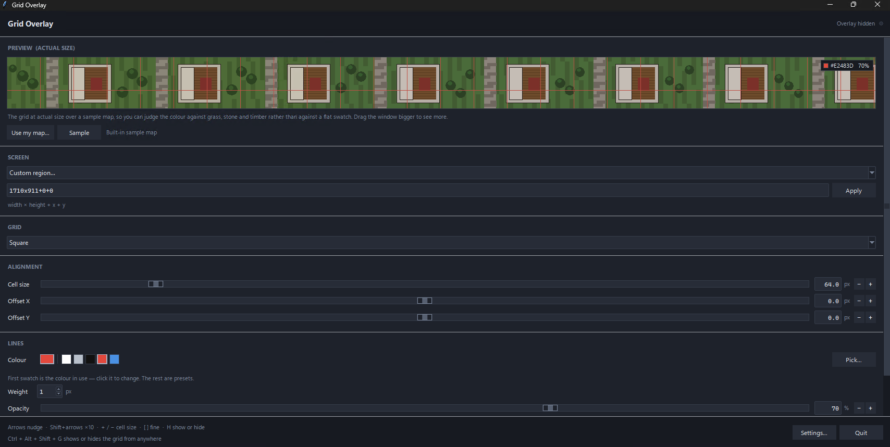

# Gridwyrm

A transparent grid overlay for tabletop maps. Pick a screen, lay a square or hex
grid over whatever is on it, and align the grid to the map by eye.

Built for running D&D on a second monitor or a table-mounted screen, where the
map comes from a VTT, an image viewer or a PDF that has no grid of its own, or
has one that doesn't match your tokens.



## Download

**[Download Gridwyrm.exe](https://github.com/LMMRZWG/Gridwyrm/releases/latest/download/Gridwyrm.exe)**

No installer, no dependencies, nothing to set up. One file: put it wherever you
like and run it.

### First run

Windows will show **"Windows protected your PC"** the first time. That is
SmartScreen reacting to an application it hasn't seen before, not a virus
warning. The file isn't code-signed, because a signing certificate costs a few
hundred pounds a year and this is free software.

Click **More info**, then **Run anyway**.

Your antivirus may also flag it. Gridwyrm registers global hotkeys, writes a
registry key if you enable autostart, and draws a transparent always-on-top
window. That is behaviour heuristics dislike, and it is also exactly what the
program is for. The source is right here if you would rather read it and build
your own copy.

## What it does

- **Square and hex grids**, hex in both pointy-top and flat-top
- **Any screen.** Picks up every monitor, or takes a custom region if the map
  only fills part of one
- **Clicks pass through.** The grid sits on top, but the mouse reaches the map
  underneath, so you can still drag tokens and scroll
- **Live alignment** with sliders, typed values, and half-pixel nudge buttons,
  for matching a map whose grid is 63.5px rather than a round number
- **Actual-size preview.** A 1:1 strip showing the grid over a sample map, or
  over your own map image, so you can judge colour and line weight without
  looking at the other screen
- **Global hotkeys** to show, hide and nudge the grid while the map has focus
- **Five themes:** Dark, Light, Classic, Colour-blind safe, and a Custom theme
  you set yourself
- **Remembers everything.** Cell size, offsets, colour, screen, window size and
  position, between runs

## Requirements

Windows 10 or 11. Nothing else.

The overlay's transparency and click-through rely on Windows APIs. The program
runs on Linux and macOS from source, but there the grid shows as a faint tint
over the whole screen and clicks won't pass through, which makes it much less
useful.

## Aligning a grid

1. **Pick the screen** the map is on, under `SCREEN`.
2. **Set the cell size** to roughly match one square on the map. Drag the
   slider, then use `−` / `+` or the `[` and `]` keys for half-pixel steps.
3. **Nudge the offset** with the arrow keys until the lines sit on the map's own
   grid. Hold Shift for ten-pixel jumps.

Once it lines up, it stays lined up. The settings are saved when you close.

## Hotkeys

Global, so they work while the map has focus. All are editable under
**Settings → Hotkeys**.

| Action | Default |
| --- | --- |
| Show / hide the overlay | `Ctrl+Alt+Shift+G` |
| Nudge the grid | `Ctrl+Alt+Shift` + arrow keys |
| Cell size smaller / larger | `Ctrl+Alt+Shift+J` / `Ctrl+Alt+Shift+K` |
| Next grid shape | `Ctrl+Alt+Shift+B` |
| Bring the panel to the front | `Ctrl+Alt+Shift+P` |

Three modifiers, deliberately. A global hotkey is claimed from every running
program, so the defaults stay clear of combinations other software wants.
`Ctrl+Alt+G`, for instance, belongs to Google Drive.

While the control panel itself has focus, the arrow keys, `+` / `−`, `[` / `]`
and `H` work on their own.

## Where things are kept

`%APPDATA%\Gridwyrm\`

| File | What it holds |
| --- | --- |
| `settings.json` | every preference, including your hotkeys and theme |
| `session.log` | a short activity log, useful if something misbehaves |
| `errors.log` | Python exceptions, if any occur |
| `crash.log` | native faults, if any occur |

Deleting `settings.json` resets Gridwyrm to defaults. Uninstalling is deleting
the `.exe` and that folder. Turn off **Start with Windows** first if you enabled
it, or remove the `Gridwyrm` value from
`HKCU\Software\Microsoft\Windows\CurrentVersion\Run`.

## Running from source

```
python gridwyrm.pyw
```

Python 3.8 or newer with tkinter, which the standard python.org installer
includes. No other packages are required.

[Pillow](https://pypi.org/project/Pillow/) is optional. If it happens to be
installed, preview images are resized more smoothly and JPEG works as well as
PNG and GIF. Gridwyrm never requires it.

### Building the .exe

Run `build_exe.bat` on a Windows machine that has Python. It installs
PyInstaller if needed and produces `dist\Gridwyrm.exe`.

## Notes

- **No telemetry, no network access.** Gridwyrm never connects to anything. The
  only files it writes are the ones listed above.
- **No bundled artwork.** The sample map in the preview is drawn in code. If you
  want to preview against a real map, point it at your own file. It is read from
  disk and goes nowhere.

## Licence

MIT. See [LICENSE](LICENSE).
